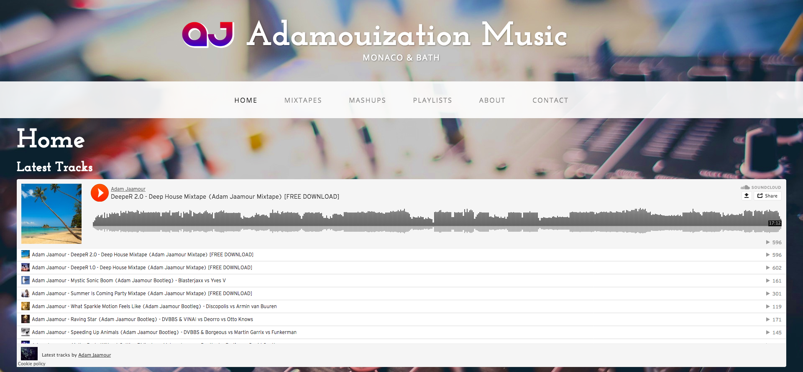
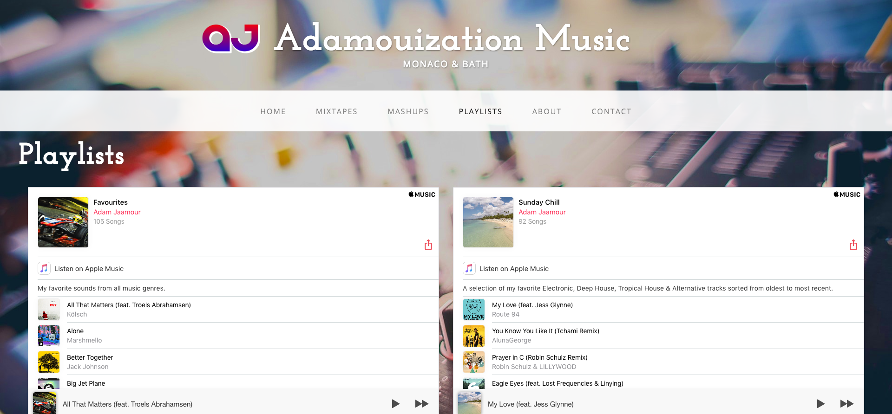
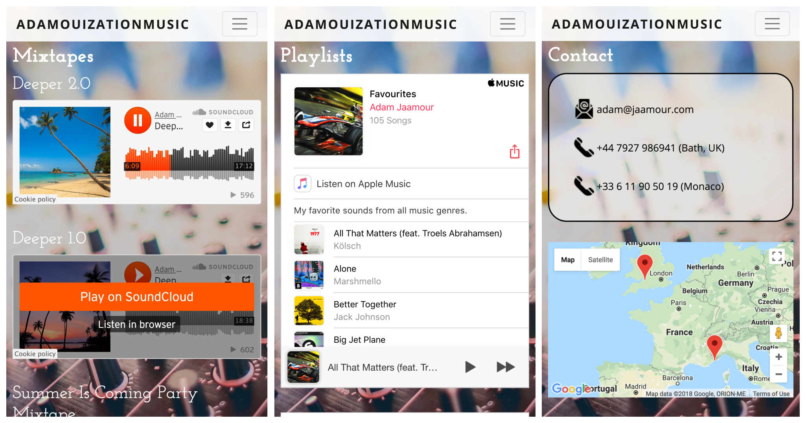

[](https://github.com/Adamouization/AdamouizationMusic/issues)
[](https://github.com/Adamouization/AdamouizationMusic/network)
[](https://github.com/Adamouization/AdamouizationMusic/stargazers)
[](https://github.com/Adamouization/AdamouizationMusic/blob/master/LICENSE)
[](http://www.adamjams.jaamour.com)
[](https://twitter.com/intent/tweet?text=Wow:&url=https%3A%2F%2Fgithub.com%2FAdamouization%2FAdamouizationMusic)

AdamouizationMusic
==================

**Adam Jams** is a website showcasing my Soundcloud posts and Apple Music playlists.

You can visit the website live here: [adamjams.jaamour.com](http://adamjams.jaamour.com/)

#### Screenshot

###### Desktop screnshots




###### Mobile screenshots


## Download
* [Version 1.0.1](https://github.com/Adamouization/AdamouizationMusic/raw/master/releases/AdamouizationMusic-v1.0.1-09042018.zip)
* [Version 1.0.0](https://github.com/Adamouization/AdamouizationMusic/raw/master/releases/AdamouizationMusic-v1.0.0-06042018.zip)

## Usage
Clone the repository (or download the zipped project):
`$ git clone https://github.com/Adamouization/AdamouizationMusic`

Move in the directory and open the `index.html` file in your web browser:
```
# Mac
$ open index.html

# PC and Linux
$ firefox index.html
```

## Challenge
The main goal/challenge of building this website was to write the code using only pure Javascript, CSS and HTML.
No frameworks were used to create this website, with Bootstrap and JQuery being the only external libraries used.

## To Do
* see  [TODO](https://github.com/Adamouization/AdamouizationMusic/blob/master/docs/TODO.md) file.

## License 
* see [LICENSE](https://github.com/Adamouization/AdamouizationMusic/blob/master/LICENSE) file.

## Contact
* email: adam@jaamour.com
* website: www.adam.jaamour.com
* twitter: [@Adamouization](https://twitter.com/Adamouization)
